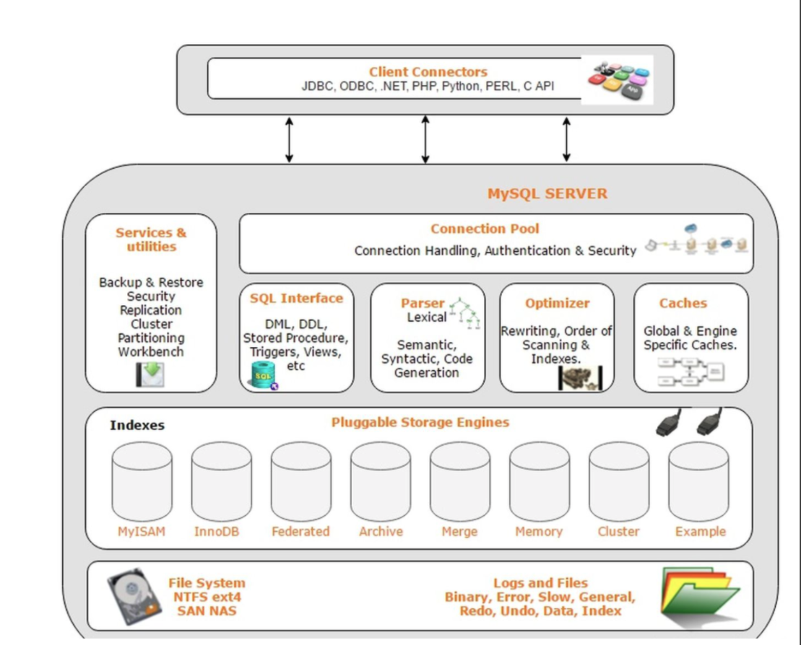
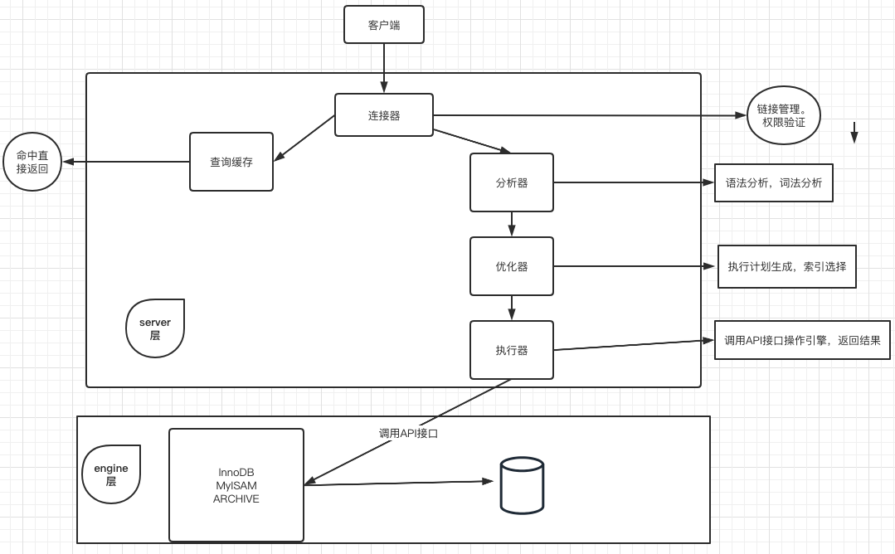
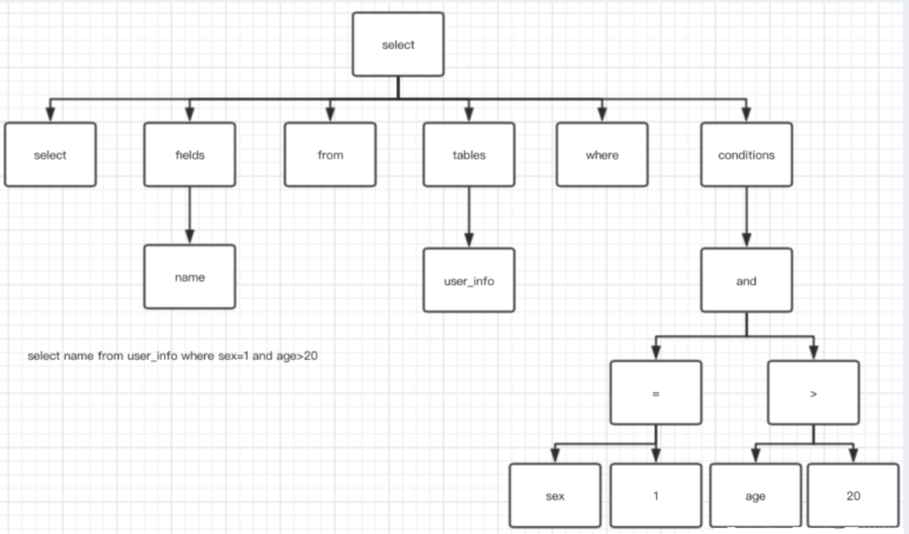

## MySQL体系结构

### 客户端与服务端模式




- MySQL基架的几大模块组件
  - MySQL向外提供的交互接口（Connectors）
    - 对外交互组件,API,如java,python,go等语言可以通过该组件连接数据库
  - 管理服务组件和工具组件(Management Service & Utilities)
    - 集成对MySQL的管理,比如备份，恢复等
  - 连接池组件(Connection Pool)
    - 负责监听对客户端向MySQL Server端的各种请求，接收请求，转发请求到目标模块。
    - 每个成功连接MySQL Server的客户请求都会被创建或分配一个线程，该线程负责客户端与MySQL Server端的通信，接收客户端发送的命令，传递服务端的结果信息等。
  - SQL接口组件(SQL Interface)
    - 接收用户SQL命令，如DML,DDL和存储过程等，并将最终结果返回给用户
  - 查询分析器组件(Parser)
    - 分析SQL语法合法
    - SQL命令分解成数据结构
    - 失败则提示语法错误
  - 优化器组件（Optimizer）
    - 对SQL命令按照标准流程进行优化分析
  - 缓存主件（Caches & Buffers）
    - 缓存和缓冲组件
  - 插件式存储引擎（Pluggable Storage Engines）
    - MySQL对表的创建,数据的存储与检索靠引擎来实现
  - 物理文件（File System）
    - data
    - 日志
    - 配置文件等

### SQL执行流程



#### 查询缓存

```
mysql> show variables like 'query_cache%';
1.MySQL 拿到一个查询请求后先会在查询缓存中看看是否执行过此语句，之前执行的语句会以 key-value 的形式缓存在内存中，key 是缓存的语句，value 是查询的结果
2.如果命中缓存则直接将结果返回,如果没有命中则继续执行后面

**额外补充**生产环境中一般会关闭cache，why?
1.命中率低:请求sql与环境(连接的数据库、协议版本、字符集等)要与缓存完全一致
2.资源消耗大:QC需要缓存最新的数据,所以在数据发生变化时(比如增删改操作)QC就会刷新,这导致缓存会频繁的写入、擦除,消耗过多资源
3.QC适用场景少:以下场景无效
  读取mysql的系统表
  子查询或者外层查询
  查询语句中用到随机函数,或者now这种函数,给查询结果带来不确定性(每次查询结果会有差异)
  查询中用到了视图,临时表
  存储过程,触发器中调用的sql也不适合
  查询语句加了SQL_NO_CACHE
  查询语句未引用任何表
  类似select into这种sql,显示加锁的sql都不会去缓存
  验证用户的访问权限(用户无权限则拒绝)
  **全局锁控制**每次更新QC的内存块都需要进行锁定，查询结果必须大于
  MySQL 8.0 直接删除查询缓存

最为重要的是，在MySQL里QC是由一个全局锁在控制，每次更新QC的内存块都需要进行锁定。
例如，一次查询结果是20KB，参数query_cache_min_res_unit 值设置为 4KB），查询结果共需要分为5次写入QC，每次都要锁定，而且容易造成block碎片

所以QC适合表数据量少,更新频率低,查询比较多,比如配置表、权限表。

关闭方法很简单,有两种:
1、同时设置选项 query_cache_type = 0 和 query_cache_size = 0；
2、如果用源码编译MySQL的话，编译时增加参数 --without-query-cache 即可；

**生产环境怎么办**
缓存数据给第三方处理,比如redis
```

#### 分析器（解析器与解析树）

语法分析

```
语法解析是解析你的语句是不是满足 MySQL 语法标准，如果不对则会 ：
ERROR 1064 (42000): You have an error in your SQL syntax … 关于错误码在官网有说明

官方地址:
https://dev.mysql.com/doc/refman/8.0/en/error-message-elements.html
https://dev.mysql.com/doc/mysql-errors/8.0/en/server-error-reference.html#error_er_open_as_readonly

#中文对照表
https://www.cnblogs.com/Nedved/p/10472467.html
```

词法分析

```
select name from user_info where sex=1 and age>20
```



#### 优化器

1.生成执行计划

```
生成一个执行计划,要做一些事情：
  选择最合适的索引；
  选择表扫还是走索引；
  选择表关联顺序；
  优化 where 子句；
  排除管理中无用表；
  决定 order by 和 group by 是否走索引；
  尝试使用 inner join 替换 outer join；
  简化子查询，决定结果缓存；
  合并视图；
```

2.查询执行计划

查询最后一次查询的消耗,选择开销最后的计划进行

```
show status like 'Last_query_cost';
```

### SQL执行顺利-内部逻辑

from->on->join->where->group by（开始使用select中的别名，后面的语句中都可以使用别名）->sum、count、max、avg->having->select->distinct->order by->limit

```
从这个顺序中我们不难发现，所有的 查询语句都是从from开始执行的，在执行过程中，每个步骤都会为下一个步骤生成一个虚拟表，这个虚拟表将作为下一个执行步骤的输入。 
第一步：首先对from子句中的前两个表执行一个笛卡尔乘积，此时生成虚拟表 vt1（选择相对小的表做基础表）。 
第二步：接下来便是应用on筛选器，on 中的逻辑表达式将应用到 vt1 中的各个行，筛选出满足on逻辑表达式的行，生成虚拟表 vt2 。
第三步：如果是outer join 那么这一步就将添加外部行，left outer jion 就把左表在第二步中过滤的添加进来，如果是right outer join 那么就将右表在第二步中过滤掉的行添加进来，这样生成虚拟表 vt3 。
第四步：如果 from 子句中的表数目多余两个表，那么就将vt3和第三个表连接从而计算笛卡尔乘积，生成虚拟表，该过程就是一个重复1-3的步骤，最终得到一个新的虚拟表 vt3。 
第五步：应用where筛选器，对上一步生产的虚拟表引用where筛选器，生成虚拟表vt4，
第六步：group by 子句将中的唯一的值组合成为一组，得到虚拟表vt5。
第七步：应用cube或者4rollup选项，为vt5生成超组，生成vt6. 
第八步：应用having筛选器，生成vt7。having筛选器是第一个也是为唯一一个应用到已分组数据的筛选器。 
第九步：处理select子句。将vt7中的在select中出现的列筛选出来。生成vt8. 
第十步：应用distinct子句，vt8中移除相同的行，生成vt9。
第十一步：应用order by子句。按照order_by_condition排序vt9，此时返回的一个游标，而不是虚拟表。sql是基于集合的理论的，集合不会预先对他的行排序，它只是成员的逻辑集合，成员的顺序是无关紧要的。对表进行排序的查询可以返回一个对象，这个对象包含特定的物理顺序的逻辑组织。这个对象就叫游标。正因为返回值是游标，那么使用order by 子句查询不能应用于表表达式。排序是很需要成本的，除非你必须要排序，否则最好不要指定order by，最后，在这一步中是第一个也是唯一一个可以使用select列表中别名的步骤。 
第十二步：应用top选项。此时才返回结果给请求者即用户。
```

## MySQL 8.0的"新姿势"

- Metadata 结构变化
  - 5.7 版本问题
    - 两套数据字典信息（Server层 frm，InnoDB 数据字典）
    - DDL无原子化
    - frm和innodb层会出现不一致
    - 并发处理需要小心处理（MDL,dict_sys::mutex,dict_sys::rw_lock）
    - 崩溃无法恢复
  - 8.0 变化
    - 支持事务性DDL，崩溃可以回滚，保证一致。
    - 保留一份数据字典信息，取消frm数据字典。
    - 数据字典存放至InnoDB表中
    - 采用套锁机制，管理数据字典的并发访问（MDL）
    - 全新的Plugin支持
      - 8.0.17+ 加入Clone Plugin,更好的支持MGR，InnoDB Cluster的节点管理
    - 安全加密方式改变
      - 改变加密方式为caching_sha2_password
      - SSL 将支持到 TLSv1.3 版本。
    - 用户管理及认证方式改变
      - 改变授权管理方式
      - 加入role角色管理
      - 添加更多权限
    - 原子性DDL
      - 支持原子性DDL
    - Cache && Buffer的变化
      - 取消Query Cache


### 


